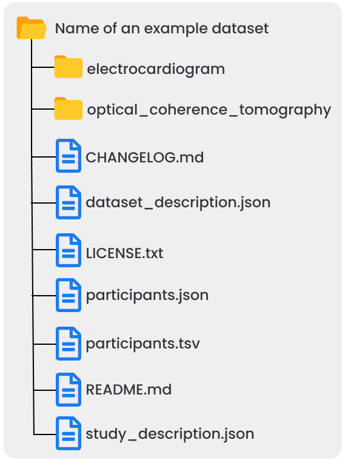

<div align="center">


<br />

<h1> Clinical Dataset Structure (CDS) </h1>

<p>
A standardized, universal high-level dataset structure for interoperable and reusable clinical research data
</p>

<br />

<p>
  <a href="https://github.com/AI-READI/high-level-dataset-structure/graphs/contributors">
    
  </a>
  <a href="https://github.com/AI-READI/high-level-dataset-structure/stargazers">
    
  </a>
  <a href="https://github.com/AI-READI/high-level-dataset-structure/issues/">
    
  </a>
  <a href="https://github.com/AI-READI/high-level-dataset-structure/LICENSE.txt">
    
  </a>
  
  <!---
  <a href="https://doi.org/10.5281/zenodo.6407300">
    
  </a>
  -->

</p>
   
<h4>
    <a href="https://github.com/AI-READI/high-level-dataset-structure/issues/">Report Issues/Make suggestions</a>
  </h4>
</div>

<br />

---

## About
Clinical research studies typically collect multimodal data that can be organized in many different ways. There is no consensus so far on how to organize and share multimodal data and metadata into a structured dataset. This lack of a standard leads to difficulties in understanding datasets and time wasted on rearranging data both of which obstruct the optimal reuse of datasets.

The Clinical Dataset Structure (CDS) is a simple and intuitive standard for the high-level organization of clinical research data. It prescribes a folder structure for organizing a dataset at the highest level (i.e., root-level) into one folder per data type wherein data type-specific standard structures can then be followed within each folder. It also prescribes several metadata files to be included at the highest level of the dataset structure for documenting relevant information about the data. 

All together, the CDS is designed to facilitate reusability of the dataset by humans and machines by making it intuitive to navigate and exposing information they may need when looking at the dataset (What is the dataset about? How many participants are in the study? What data types where collected, etc.). This is crucial to faciliate the understanding of a dataset and also enable combining different datasets together easily for statistical analysis, AI/ML-based modeling, and such.

We are developing the CDS at part of the AI-READI project where we identified a gap in organizing multimodal data into a standard structure. This repository contains details about the CDS specifications and templates to help implement them.

Note: While the focus of the CDS is on clinical research data, the CDS could be used/adapted for pre-clinical (non-human) research data and clinical trial data but this may require further effort.

<div align="center">
    
    <p><i> Illustration of a dataset with two data types (electrocardiogram and optical coherence tomography) structured following the CDS. </i></p>
</div>

## Specifications

The specifications of the latest released version of the CSD can be found [here](main). 

## Structure of this repository
Each version of the CSD standard are stored in a dedicated folder under the `versions` folder. An assessment of the compliance of the CSD with the relevant FAIR principles is also included with each version. The corresponding templates are in the `template` folder. The `main` folder contain a copy of the latest released version where edits/suggestions can be made via pull request. At the time of the release of a new version of the CDS, the version in the `main` folder will be copied in the `versions` folder and renamed after the new version number. Changes between the different versions are tracked in the [CHANGELOG](CHANGELOG.md) file. 

## Contributing

<a href="https://github.com/AI-READI/high-level-dataset-structure/graphs/contributors">
  
</a>

Contributions are always welcome!

Use the [GitHub issues](https://github.com/AI-READI/high-level-dataset-structure/issues) for submitting feedback or making suggestions. You can also fork the repository and submit a pull request with suggestions. Make your suggestions on the `main` folder of the main branch if making suggestions on the last released version of the CDS or on the `main` folder of the staging branch if making suggestions on the lastest draft version (suggested). Make sure to read our [Contributing guidelines](CONTRIBUTING.md).

## License

This work is licensed under a
[Creative Commons Attribution 4.0 International License][cc-by]. See [LICENSE](LICENSE.txt) for more information.

[cc-by]: http://creativecommons.org/licenses/by/4.0/
[cc-by-image]: https://i.creativecommons.org/l/by/4.0/88x31.png
[![CC BY 4.0][cc-by-image]][cc-by]


## How to cite

If you are using the CDS or any of the associated effort, please cite:

```bash
    Coming soon
```

## Acknowledgements

This project is funded by the NIH under award number 1OT2OD032644. The content is solely the responsibility of the authors and does not necessarily represent the official views of the NIH.

<br />

---

<br />

<div align="center">

<a href="https://aireadi.org">
  
</a>

</div>
