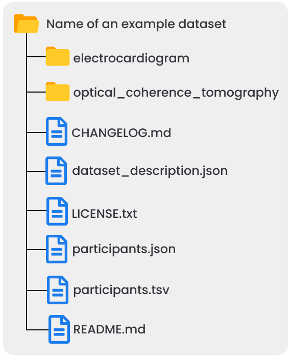

# Biomedical and Clinical Dataset Structure (BCDS) v 1.0.0

## Definitions

- The keywords "MUST", "MUST NOT", "REQUIRED", "SHALL", "SHALL NOT", "SHOULD", "SHOULD NOT", "RECOMMENDED", "MAY", and "OPTIONAL" in this document are to be interpreted as described in [RFC2119](https://www.ietf.org/rfc/rfc2119.txt).
- Dataset: A set of data files and associated metadata files issued from a biomedical and/or clinical research study.
- Data type: In a biomedical/clinical research study, multiple modalities of data are collected. We designate by data type data from a modality or a group of modalities than can collected and interpreted independently of other modalities.

## High-level data structure
- The data files must be organized into one folder per data type. No data file must be present at the highest level of a dataset. 
- Each folder must be named following the specification provided [here](folder_naming/folder_naming_specs.md). 
- Inside each folder, the data must be organized according to existing community-accepted standard for that data type if available or following some other standard structure. This must be documented in the metadata files as explained in the metadata files specifications. 
- No empty folders are allowed.

## High-level metadata files
The following metadata files must be included at the highest level:
- dataset_description.json: A metadata file containing provenance metadata, contextual metadata, as well as additional metadata necessary for reuse of the dataset. This metadata file is intended to prioritize machine readability. See [here](metadata_files/dataset_description_specs.md) for specifications about this metadata file. 
- README.md: A metadata file containing a detailed description of the dataset in a human-friendly format to supplement the dataset_description.json file. See [here](metadata_files/readme_specs.md) for specifications about this metadata file. 
- participants.tsv and participants.json: Metadata files containing basic information about the participants in the study. The participant.tsv file contains the information while the participant.json file acts as a sidecar that describes the columns in the participant.json file. See [here](metadata_files/participants_specs.md) for specifications about this metadata file. 
- CHANGELOG.md: A metadata file containing information about the changes between different versions of the dataset that are released. See [here](metadata_files/changelog_specs.md) for specifications about this metadata file. 
- LICENSE.txt: A metadata file containing the terms under which the dataset is shared. See [here](metadata_files/license_specs.md) for specifications about this metadata file. 

## Example

A template with example is available in the [`template` folder](../../template).

An image of a example dataset with two data types (electrocardiogram and optical coherence tomography) is shown below.

